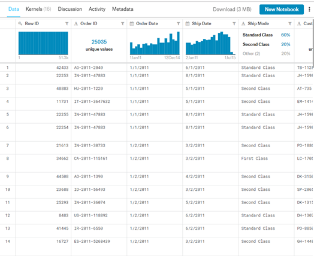
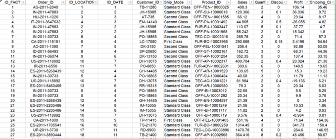
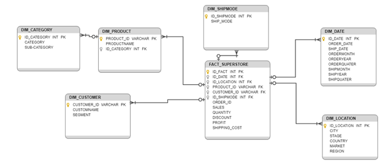
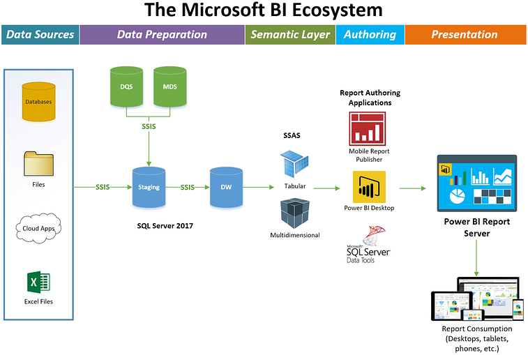

# Super Store Data Warehouses
 
## Giới thiệu tổng quan về datasets:

### 1. Phát biểu về dữ liệu:
 - Kho dữ liệu Super Store là một kho dữ liệu thu thập việc bán lẻ trực tuyến của một siêu thị toàn cầu trong vòng 4 năm (từ năm 2011-2015)
 - Thông qua kho dữ liệu người dùng có thể biết được thông tin ngày đặt hàng, giao hàng của một đơn hàng, thông tin đơn hàng đó của khách hàng nào, giá, số lượng, tỉ lệ khuyến mãi, phí vận chuyển, loại khách hàng, …
 - Link gốc: https://www.kaggle.com/jr2ngb/superstore-data  
**Data Khi chưa Xử Lý** 
 
**Data sau khi đã xử lý (loại bỏ các cột không xử dung, xử lý dữ liệu NULL)** 

### 2. Xây dựng data warehouses:
**Star Schema:** 
  
**Fact SuperStore** 
| Khóa chính|Tên thuộc tính| Kiểu dữ liệu  |Mô tả Dữ Liệu|Null|
|---------| ---------- | --------------|-----------|--|
|PK |ID_FACT|varchar|Mã bảng Fact|
|FK | ID_Location |int  |Mã địa điểm|
|FK | ID_date |int |Mã ngày|
|FK| Customer_ID |varchar  |Mã khách hàng|
|FK| Product_ID | int |Mã sản phẩm|
|   | Order_ID | varchar |Mã đơn hàng|
|FK | ID_ShipMode | int |Mã chế độ vận chuyển|
|   | Sales | money |Đơn giá ($)|
|   | Quantity | varchar |Số lượng|
|   | Quantity | varchar |% khuyến mãi|

**Dim Location**
| Khóa chính|Tên thuộc tính| Kiểu dữ liệu  |Mô tả Dữ Liệu|Null|
|---------| ---------- | --------------|-----------|--|
| PK |ID_LOCATION| int|Mã địa điểm|
|   | City |varchar  |Tên thành phố|
|   | Stage |varchar |Tên tiểu bang|
|   | Country |varchar  |Tên quốc gia|
|   | Market | varchar |Tên thị trường|
|   | Region | varchar |Tên vùng lãnh thổ|

**Dim Date**
| Khóa chính|Tên thuộc tính| Kiểu dữ liệu  |Mô tả Dữ Liệu|Null|
|---------| ---------- | --------------|-----------|--|
| PK |ID_DATE| int|Mã ngày|
|   | Order_date |Datetime|Ngày đặt hàng|
|   | Ship_date |Datetime |Ngày giao hàng|X|
|   | OrderMonth |int  |Tháng đặt hàng|
|   | OrderYear | int |Năm đặt hàng|
|   | OrderQuater | int |Quí đặt hàng|
|   | ShipMonth | int |Tháng giao hàng|X|
|   | ShipYear | int |Năm giao hàng|X|
|   | ShipQuater | int |Quí giao hàng|X

**Dim Customer**    
| Khóa chính|Tên thuộc tính| Kiểu dữ liệu  |Mô tả Dữ Liệu|Null|
|---------| ---------- | --------------|-----------|--|
| PK |CUSTOMER_ID| varchar|Mã khách hàng|
|   | CustomerName |varchar  |Tên khách hàng|
|   | Segment |varchar |Bộ phận khách hàng ( có 3 bộ phận: Consumer, Home office, Corperate )|

**Dim Product**
| Khóa chính|Tên thuộc tính| Kiểu dữ liệu  |Mô tả Dữ Liệu|Null|
|---------| ---------- | --------------|-----------|--|
| PK |PRODUCT_ID| number|Mã sản phẩm|
|   | ProductName |int  |Tên sản phẩm|
| FK| Category_ID |varchar |Mã loại sản phẩm|

**Dim Category**
| Khóa chính|Tên thuộc tính| Kiểu dữ liệu  |Mô tả Dữ Liệu|Null|
| --------| -------- | ---------- |---------- |-|
| PK |Category_ID| varchar|Mã loại sản phẩm|
|   | Category  |varchar  |Loại sản phẩm|
|   | Sub-Category |varchar |Tiểu mục của loại sản phẩm|

**Dim ShipMode**
| Khóa chính|Tên thuộc tính| Kiểu dữ liệu  |Mô tả Dữ Liệu|Null|
| --------| -------- | ---------- |---------- |-|
| PK |ID_ShipMode| int|Mã chế độ vận chuyển|
|   | Ship_Mode |varchar  |Tên chế độ vận chuyển|

## Nội dung 15 câu hỏi truy vấn:
    a) Cho biết tổng doanh số bán hàng ở nước Germany theo từng năm.
    b) Cho biết thông tin khách hàng (tên khách hàng, loại khách hàng) đạt tổng số tiền mua cao
    nhất trong quý 2 năm 2012.
    c) Cho biết tên khách hàng có tổng số lượng sản phẩm đã mua trên 5 tại bang Texas.
    d) Đưa ra phần trăm về phí vận chuyển của từng từng thị trường (Market) trong năm 2013.
    e) Theo từng tháng, quý, năm liệt kê loại hình vận chuyển cùng với phí vận chuyển của loại
    hình đó (nếu có).
    f) Cho biết tên sản phẩm, loại sản phẩm và tổng số lượng sản phẩm đó lớn hơn 10 được đặt
    theo từng quốc gia.
    g) Với từng thành phố liệt kê số lượng chi tiết đơn hàng bán ra theo từng năm, trừ thành phố
    Zurich và Zhuhai.
    h) Đưa ra TOP 3 sản phẩm có lợi nhuận nhiều nhất trong năm 2013.
    i) Thống kê lợi nhuận, doanh thu, và phần trăm lợi nhuận từng loại sản phẩm, sắp xếp theo
    thứ tự phần trăm lợi nhuận giảm dần.
    j) Cho biết khách hàng có số lần mua hàng cao nhất và khách hàng có số lần mua hàng thấp
    nhất.
    k) Liệt kê những sản phẩm (ID) có doanh thu từ $1000 đến $10000.
    l) Đưa ra doanh thu, lợi nhuận, số lượng sản phẩm bán ra của từng tiểu mục sản phẩm (SubCategory).
    m) Với mỗi quốc gia đưa ra 3 thành phố có lợi nhuận cao nhất.
    n) Đưa ra 3 sản phẩm có số lượng mua hàng ít nhất tại New Zealand.
    o) Liệt kê những sản phẩm thuộc top 5 soanh thu cao nhất hoặc top 3 số lượng bán cao nhất.

## Quy trình tích hợp và phân tích:

## Trực quan hóa dữ liệu trên Power BI:

